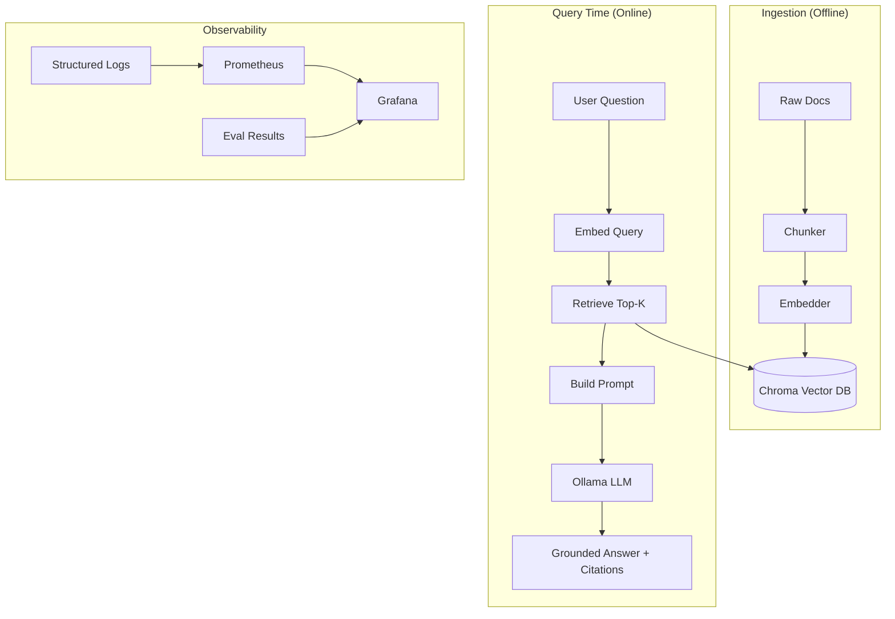

# httpx Codebase & Docs Q&A Assistant

> A Retrieval-Augmented Generation system that answers questions grounded in the [httpx](https://github.com/encode/httpx) library's actual source code and documentation, with citations. Built with FastAPI, Chroma, and the Groq API.

[](https://github.com/Tej2426/rag-assistant/actions)
[](https://hub.docker.com/r/Tej2426/rag-assistant)
[](https://opensource.org/licenses/MIT)

---

## 🎯 Overview

This project demonstrates a **production-grade RAG system** that goes beyond tutorial implementations. The corpus is a real codebase — a subset of [httpx](https://github.com/encode/httpx)'s own source and documentation (BSD-3-Clause licensed, see [LICENSE](LICENSE)) — so it answers questions grounded in actual implementation, not just prose docs. It includes:

- **Clean data pipeline** — HTML/YAML stripping, structure-aware chunking, quality validation
- **Observable by default** — Structured logging, Prometheus metrics, Grafana dashboards
- **Evaluated rigorously** — Automated evaluation (context precision, recall, faithfulness, answer relevancy)
- **Deployable** — Docker Compose for local dev, multi-stage Dockerfile for production
- **Secure** — API key auth, rate limiting, input validation
- **Extensible** — Pluggable ingestion for PDFs, HTML, Notion, Confluence

### Architecture



---

## 🚀 Quick Start

### Prerequisites
- Docker & Docker Compose
- 8GB+ RAM (for Ollama models)

### 1. Clone & Configure
```bash
git clone https://github.com/Tej2426/rag-assistant.git
cd rag-assistant
cp .env.example .env  # Edit if needed
```

### 2. Start Services
```bash
docker compose up -d
```

This starts:
- **rag-assistant** (FastAPI) — http://localhost:8000
- **Chroma** (Vector DB) — http://localhost:8001
- **Ollama** (LLM) — http://localhost:11434
- **Prometheus** — http://localhost:9090
- **Grafana** — http://localhost:3000 (admin/admin)

### 3. Ingest Documentation
```bash
# Chunk documents
docker compose exec rag-assistant python -m src.ingestion.chunker

# Generate embeddings
docker compose exec rag-assistant python -m src.ingestion.embedder
```

### 4. Use It
- **Playground UI**: http://localhost:8000/playground
- **API Docs**: http://localhost:8000/docs
- **Evaluation**: http://localhost:8000/eval
- **Health**: http://localhost:8000/health

---

## 📖 API Usage

### Query the RAG System
```bash
curl -X POST http://localhost:8000/api/query \
  -H "Content-Type: application/json" \
  -H "X-API-Key: your-api-key" \
  -d '{
    "question": "How do I validate a query parameter in FastAPI?",
    "top_k": 4,
    "model": "phi3:mini",
    "temperature": 0.1
  }'
```

**Response:**
```json
{
  "answer": "In FastAPI, you validate query parameters using the `Query` class...",
  "sources": [
    {
      "id": "tutorial_query-params::2",
      "text": "To declare a query parameter with validation...",
      "heading": "Query Parameters and String Validations",
      "source": "tutorial_query-params",
      "score": 0.923,
      "chars": 542
    }
  ],
  "latency_ms": 1247,
  "model": "phi3:mini",
  "request_id": "a1b2c3d4"
}
```

### Run Evaluation
```bash
curl -X POST http://localhost:8000/api/eval/run \
  -H "X-API-Key: your-api-key" \
  -d '{"dataset": "default"}'
```

---

## 🏗️ Project Structure

```
rag-assistant/
├── src/
│   ├── main.py                 # FastAPI app entry point
│   ├── api/routes.py           # API endpoints
│   ├── rag/pipeline.py         # Core RAG pipeline
│   ├── ingestion/
│   │   ├── chunker.py          # Structure-aware chunking
│   │   └── embedder.py         # Embedding + vector storage
│   ├── eval/runner.py          # Evaluation runner
│   └── shared/                 # Shared infrastructure
│       ├── config.py           # Pydantic Settings
│       ├── auth.py             # API key + rate limiting
│       ├── observability.py    # Logging + metrics
│       ├── models.py           # Pydantic models
│       ├── exceptions.py       # Error handling
│       └── app_factory.py      # App factory
├── ui/
│   ├── templates/              # Jinja2 templates
│   │   ├── base.html           # Base layout with theme
│   │   ├── components.html     # Reusable UI components
│   │   ├── rag_layout.html     # RAG-specific layout
│   │   ├── playground.html     # Interactive playground
│   │   └── eval_dashboard.html # Evaluation dashboard
│   └── static/                 # Static assets
├── data/
│   ├── raw/                    # Source documents
│   ├── chunks.jsonl            # Chunked output
│   └── chroma/                 # Vector database
├── eval/
│   └── results/                # Evaluation outputs
├── monitoring/
│   ├── prometheus.yml          # Prometheus config
│   └── grafana/                # Grafana dashboards/datasources
├── tests/                      # Pytest suite
├── docker-compose.yml          # Local development
├── Dockerfile                  # Production image
├── pyproject.toml              # Dependencies + tooling
└── README.md                   # This file
```

---

## 🔧 Configuration

All configuration via environment variables (`.env`):

```bash
# Application
APP_NAME=RAG Document Q&A Assistant
APP_VERSION=0.1.0
ENVIRONMENT=development
DEBUG=true

# Server
HOST=0.0.0.0
PORT=8000

# Security
API_KEY=your-secure-api-key-here
RATE_LIMIT_REQUESTS=100
RATE_LIMIT_WINDOW=60

# Logging
LOG_LEVEL=INFO
LOG_FORMAT=console  # or "json"

# Chroma
CHROMA_HOST=chromadb
CHROMA_PORT=8000
CHROMA_COLLECTION=fastapi_docs

# Ollama
OLLAMA_HOST=http://ollama:11434
OLLAMA_MODEL=phi3:mini
OLLAMA_TIMEOUT=300

# Embeddings
EMBEDDING_MODEL=all-MiniLM-L6-v2
EMBEDDING_DEVICE=cpu
EMBEDDING_BATCH_SIZE=32

# Monitoring
PROMETHEUS_ENABLED=true
```

---

## 📊 Evaluation Metrics

| Metric | Description | Target |
|--------|-------------|--------|
| **Context Precision** | Fraction of retrieved chunks that are relevant | > 0.8 |
| **Context Recall** | Fraction of relevant topics found in retrieved chunks | > 0.8 |
| **Faithfulness** | Answer grounded in retrieved context (no hallucination) | > 0.8 |
| **Answer Relevancy** | Answer addresses the question | > 0.8 |

Run evaluation:
```bash
# Via API
curl -X POST http://localhost:8000/api/eval/run -H "X-API-Key: $API_KEY" -d '{}'

# Via CLI
docker compose exec rag-assistant python -m src.eval.runner
```

Results saved to `eval/results/latest.json` and displayed at `/eval`.

---

## 🐳 Deployment

### Local Development
```bash
docker compose up -d
docker compose logs -f rag-assistant
```

### Production (Fly.io / Render / Railway)
```bash
# Build image
docker build -t rag-assistant:latest .

# Run with production env
docker run -d \
  -p 8000:8000 \
  -e ENVIRONMENT=production \
  -e API_KEY=$PROD_API_KEY \
  -e LOG_FORMAT=json \
  rag-assistant:latest
```

---

## 🧪 Testing

```bash
# Run all tests
docker compose exec rag-assistant pytest -v

# With coverage
docker compose exec rag-assistant pytest --cov=src --cov-report=term-missing

# Only unit tests
docker compose exec rag-assistant pytest -m unit -v
```

---

## 📝 Development

### Code Quality
```bash
# Lint
docker compose exec rag-assistant ruff check .

# Format
docker compose exec rag-assistant ruff format .

# Type check
docker compose exec rag-assistant mypy src
```

### Adding New Documents
```bash
# 1. Add markdown files to data/raw/
# 2. Re-run ingestion
docker compose exec rag-assistant python -m src.ingestion.chunker
docker compose exec rag-assistant python -m src.ingestion.embedder
```

---

## 🗺️ Roadmap

- [ ] **RAGAS integration** — Full LLM-as-judge evaluation
- [ ] **Conversation memory** — Multi-turn chat with context
- [ ] **Hybrid search** — BM25 + vector search
- [ ] **Reranking** — Cross-encoder reranking
- [ ] **Streaming responses** — Token-by-token streaming
- [ ] **Multi-tenancy** — Isolated collections per tenant
- [ ] **Admin UI** — Document management, eval monitoring

---

## 📄 License

MIT License — see [LICENSE](LICENSE) for details.

---

## 🤝 Contributing

1. Fork the repository
2. Create a feature branch
3. Make your changes with tests
4. Run `pre-commit run --all-files`
5. Submit a PR

---

**Built with** ❤️ **for the AI Engineering portfolio** — demonstrating production-grade RAG, not just tutorials.